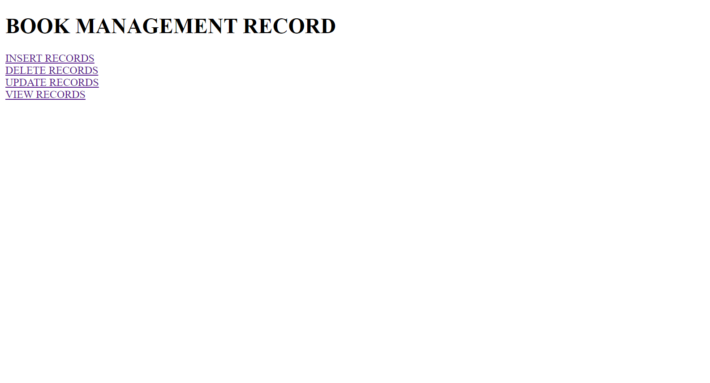
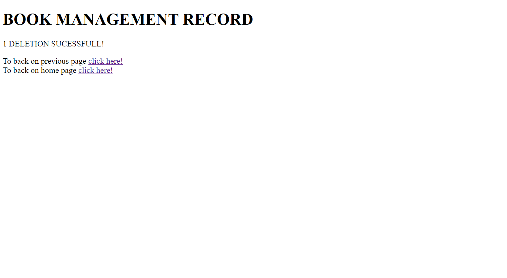
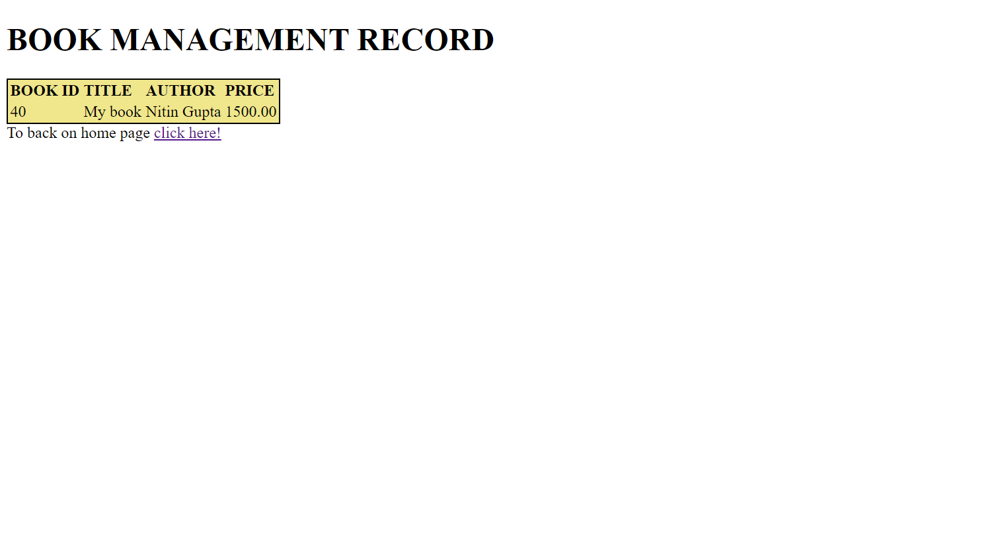

# BOOK MANAGEMENT APPLICATION
This application completely based on backend ,to understand things,php database, how to connect database with php

### Features

Insert Record
View Record
Update Record
Delete record

### Technology Stack

CSS
HTML
PHP
MYSQL

## Home page

## insert page

## Insertion sucessfull page

## View page

## Update page

## Updation sucessfull page 

## Delete page

## Deletion sucessfull page

## View page

